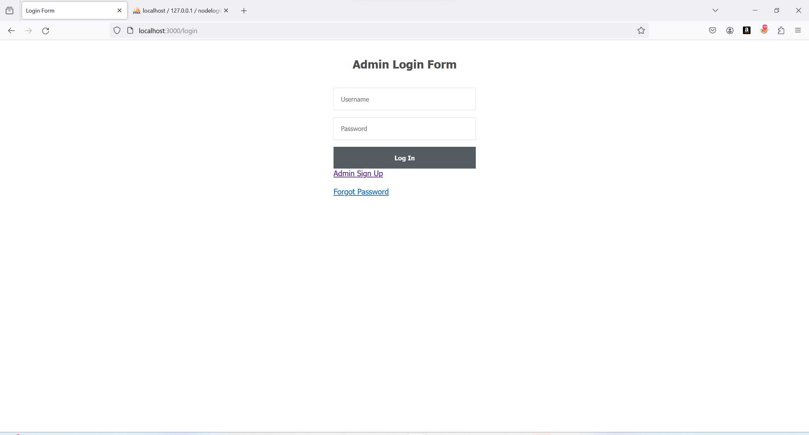

# Hospital-Management - A secure web application
An existing application - Hospital management system using nodejs , express , mysql , ejS was used in order to implement technologies to exhibhit qualities of a secured web application.

express-validator is used for input validation.
nodemailer is used for MFA implementation.
bcrypt is used for hashing the password & comparing the hash.
express-rate-limit is used for implementing rate limit.
JWT is used for session management.
Helmet is used for setting HTTP security headers.
Winston is used for implementing server logs.
Morgan is used for auditing & monitoring purposes.

Landing Page

Admin Sign Up

Admin Login

Admin Home

User

Medicine Store

Report Generate

Add Employee Leave

